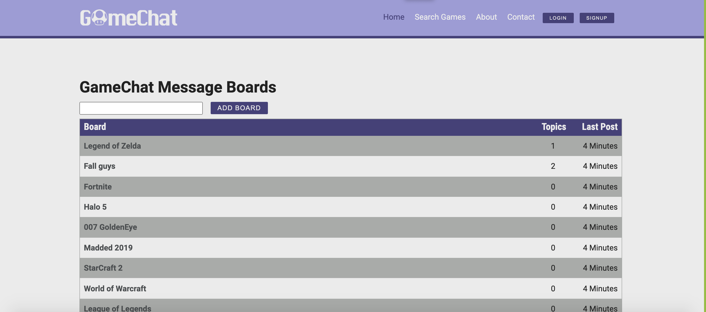

# GameChat 

GameChat is a online gaming forum where users can chat and share information about their favorite games along with searching specific games and looking up details about that game. Full CRUD funtionality is supported to add, edit and delete your posts on the forums. [Deployed Project](https://dry-mountain-75273.herokuapp.com/)


## User Stories
(https://i.imgur.com/Myvstk5.png)

## Phases of Completion
1. No-auth features first
    1. Set up databases
    2. Add posting function to forums
    3. Layout the base layout of app
2. Models routes and api
    1. Edit, add, delete post
    2. Fetch game api 
    3. Make post topics
3. User auth 
    1. Set up passport local and user
    2. Add sign in and register feature
    
4. Extras
    1. Using slate to add an text editor
    
    ...

GameChat is a online gaming forum where users can chat and share information about their favorite games along with searching specific games and looking up details about that game. Full CRUD funtionality is supported to add, edit and delete your posts on the forums. [Deployed Project] (https://hidden-anchorage-41934.herokuapp.com/)


## WireFrames
(https://imgur.com/a/hYmcMgU)

## Project Board
https://github.com/johncoryk/react-message-board/projects

## CRUD 
```
| Name            | Description                                                         |
| --------------- | ------------------------------------------------------------------- |
| Express         | Framework used to build web applications and API's                  |
| ReactJs         | Front end framework         |
| Morgan          | HTTP request logger for middlewear                                  |
| Method-override | Allows you to alter the default behavior such as put and delete     |
| Body-parser     | Parses incoming request bodies allowing it to be access by req.body |
| Express-session | Allows the application to store a state, used for user login        |
| Bcrypt          | Library that allows hashing and comparing of passwords              |
| PG-promise      | PostgreSQL library with built-in promises                           |
| Dotenv          | Storing and configuring variable in the env separate from the code  |
| Nodemon         | Monitors changes in source code and restarts the server             |
| psql             | Postgres                                      |

```

## Phases of Completion
1. No-auth features first
  - Set up databases
  - Add posting function to forums
  - Layout the base layout of app
2. Models routes and api
  - Edit, add, delete post
  - Fetch game api 
  - Make post topics
3. User auth 
  - Set up passport local and user
  - Add sign in and register feature
    
4. Extras
  - Using slate to add an text editor
    

## WireFrames
(https://imgur.com/a/hYmcMgU)

## Project Board
https://github.com/johncoryk/react-message-board/projects


## Built With
- React
- Express
- Sql

## Authors

Cory Kelly  ||  Sam Choi || Jonathan Rawlings 

## Links and Resources 
- Potential API to use to get game information: https://blog.api.rakuten.net/top-gaming-api/
- Ideas and inspiration: https://reddit.com https://gamefaqs.gamespot.com/boards


## Future Improvements
With more time a text editor and customizable user profiles would have been added to give the app more flair, along with up votes and downvotes on topics and posts. Also we would like to have added a feature to search for specific boards and topics.

